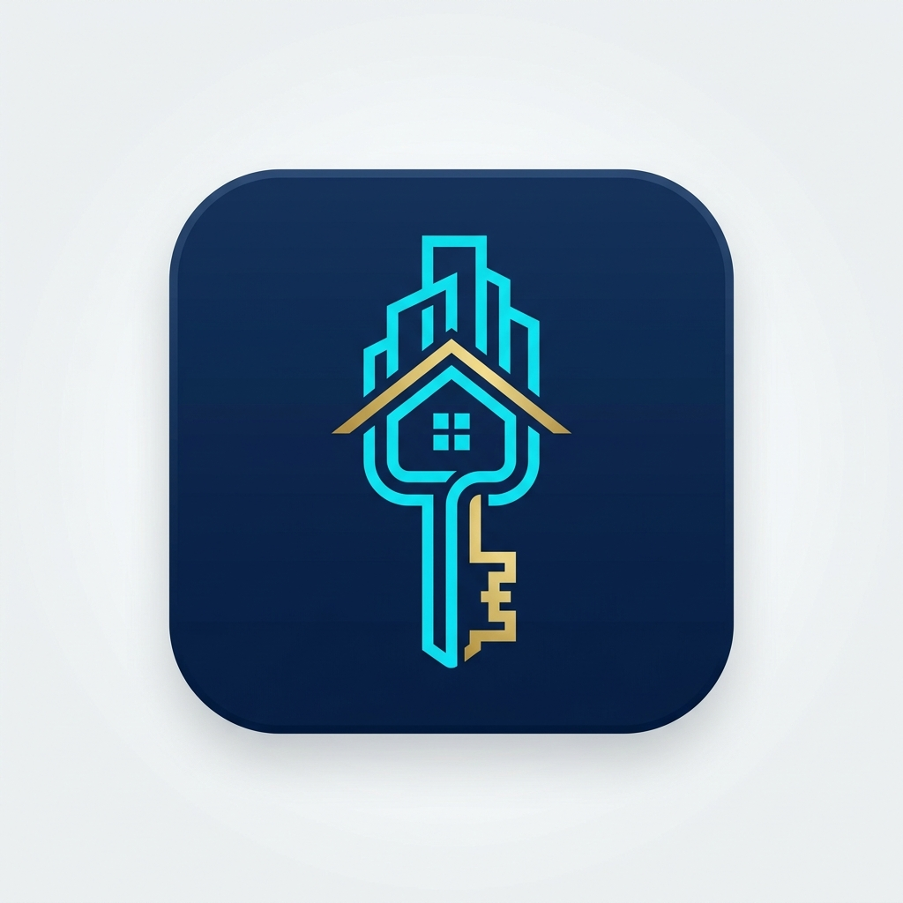
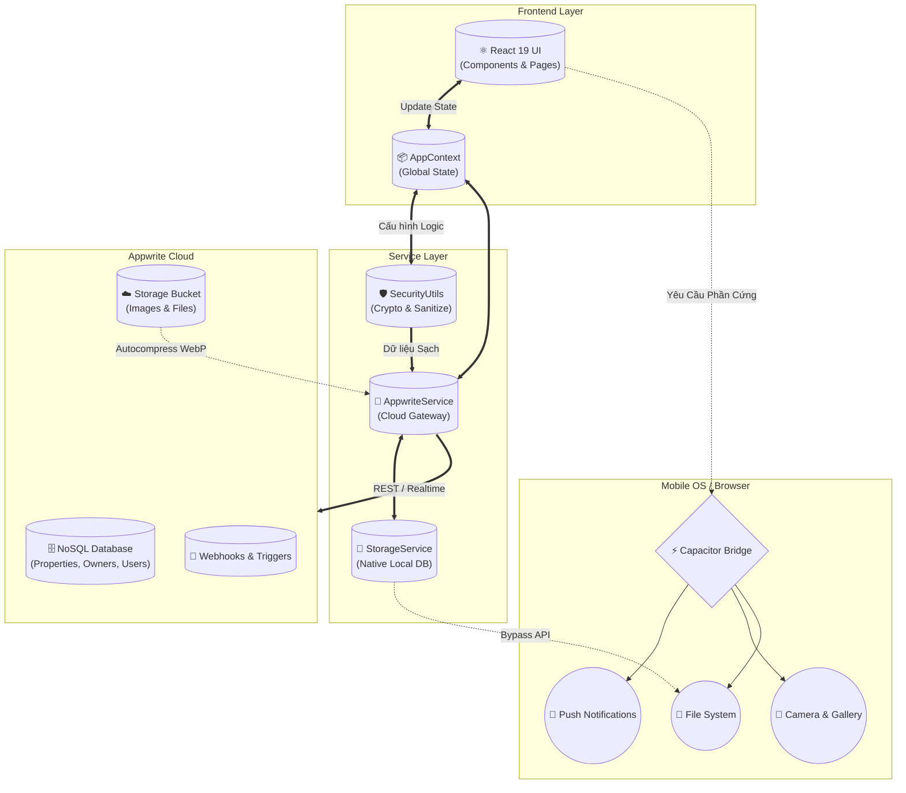

<div align="center">
  

  # 🏢 RentMaster Pro
  
  <p><b>Nền tảng Quản Lý Bất Động Sản & Đám Mây Toàn Diện Cho Chuyên Gia</b><p>

  [](https://react.dev/)
  [](https://capacitorjs.com/)
  [](https://appwrite.io/)
  [](https://tailwindcss.com/)

</div>

---

## 🌟 Tổng Quan Dự Án

**RentMaster Pro** là một hệ sinh thái quản lý bất động sản cao cấp, được thiết kế chuyên biệt để hoạt động mượt mà như một ứng dụng gốc (Native App) trên cả Web, Android và iOS. Với năng lực đồng bộ đám mây tự động thông qua **Appwrite Backend**, nền tảng trao quyền cho các chủ nhà và nhà quản lý tài sản kiểm soát hợp đồng, theo dõi dòng tiền và nhận thông báo theo thời gian thực.

### ✨ Tính Năng Cốt Lõi

*   **👥 Quản Lý Đa Chủ Thể:** Phân quyền lưu trữ hồ sơ nhiều chủ nhà (Owners) và tệp khách thuê (Tenants) phức tạp.
*   **🏘️ Hồ Sơ Bất Động Sản:** Chứa thông số kiến trúc chi tiết, hợp đồng, lịch sử thanh toán, và thư viện ảnh nén WebP siêu nhẹ.
*   **⏰ Hệ Thống Nhắc Việc Tự Động (Smart Schedules):** Cảnh báo hợp đồng sắp hết hạn, visa người nước ngoài, lịch thu tiền điện, nước...
*   **☁️ Cloud Sync & Offline Support:** Kiến trúc NoSQL hoạt động liên tục 24/7 kể cả khi mất kết nối mạng. Cơ chế tự lưu cache cục bộ bằng hệ thống lưu trữ Native.
*   **🛡️ Bảo Mật Cấp Cao:** Dữ liệu tự động Sanitize chống XSS, mật khẩu được mã hoá một chiều SHA-256 nội bộ, và bảo vệ giới hạn File băng thông (5MB Quotas).

## 🧩 Kiến Trúc Hệ Thống (Architecture Flow)

Dưới đây là sơ đồ luồng dữ liệu minh hoạ sức mạnh kiến trúc lai (Hybrid Architecture) của **RentMaster Pro**:



## 🛠 Ngăn Xếp Công Nghệ (Tech Stack)

*   **🖥️ Frontend:** React 19, TypeScript, Vite.
*   **💅 Giao Diện (UI/UX):** Tailwind CSS, Lucide Icons, CSS Animation.
*   **🏗️ Đóng Gói (Mobile App):** Capacitor 6 (với Plugins `camera`, `local-notifications`, `filesystem`).
*   **🌐 Backend & Database:** Appwrite Cloud (Backend-As-A-Service).

## 🚀 Hướng Dẫn Cài Đặt & Triển Khai

> **Lưu ý Quan Trọng:** Vui lòng trỏ các thẻ Appwrite API về hệ thống Cloud của bạn bằng cách thiết lập tệp `.env.local` ở thư mục gốc trước khi Build.

### 1. Trải Nghiệm Môi Trường Web (Dev Mode)

Môi trường yêu cầu **Node.js 18+**. Chạy các lệnh sau:

```bash
# 1. Cài đặt các gói phụ thuộc
npm install

# 2. Khởi động máy chủ Server cục bộ tại http://localhost:3000
npm run dev
```

### 2. Khởi Tạo & Đóng Gói Native Android / iOS

Sau khi hoàn tất thay đổi trên Web, tiến hành đồng bộ gói Bundle với Engine Native:

```bash
# 1. Thu nhỏ, xoá comment và build sắn gói tĩnh
npm run build

# 2. Bơm toàn bộ Code web vào bộ khung của Android/iOS (Sync qua Capacitor)
npx cap sync android
# HOẶC
npx cap sync ios

# 3. Đóng gói cho Android:
cd android && gradlew.bat assembleDebug
```
*Ghi chú: Lệnh `assembleDebug` sẽ tự động sinh file APK siêu nhẹ. Nếu muốn đăng lên store, bạn cần chuyển sang tuỳ chọn Build Release của Gradle.*

---

## 📚 Tài Liệu Bổ Sung

Cho Quản Trị Viên và Lập Trình Viên phát triển kế thừa:
*   [📄 APPWRITE_SETUP_GUIDE.md](./APPWRITE_SETUP_GUIDE.md): Hướng dẫn kích thước Data Schema và cấu hình cơ sở dữ liệu (Database + Storage) trên Appwrite Cloud.
*   [📱 MOBILE_BUILD_GUIDE.md](./MOBILE_BUILD_GUIDE.md): Hướng dẫn xuất bản đa nền tảng PWA (Dành cho iOS) và Android thuần tuý.

<br/>
<div align="center">
  <sub>Sản phẩm được tối ưu hoá nền tảng và bảo mật bởi <b>Antigravity AI</b>.</sub>
</div>